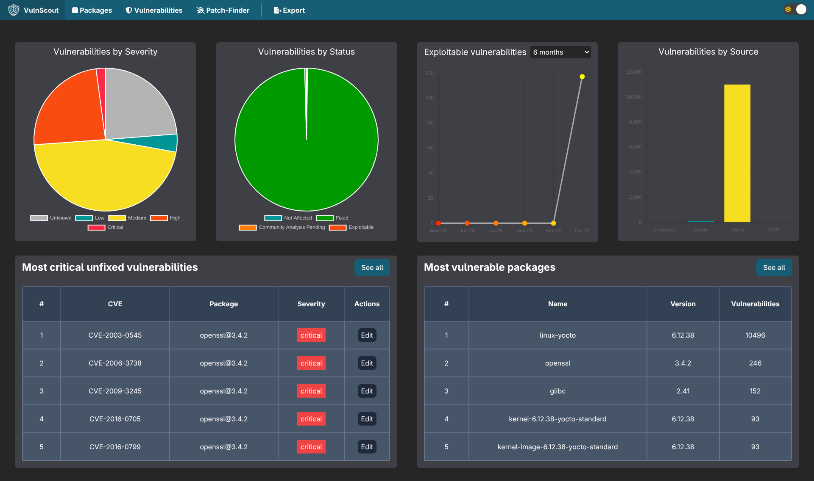

:url-repo: https://github.com/savoirfairelinux/vulnscout
:source-highlighter: highlight.js

image::https://img.shields.io/badge/License-GPL%203.0-green.svg[License, link=https://opensource.org/license/gpl-3-0]

---

== What is VulnScout?

**VulnScout** is an open-source tool that helps you identify, track and resolve
software vulnerabilities in your systems using a Software Bill of Materials
(SBOM).

It collects and correlates vulnerability information from multiple sources,
including CVE, OSV, NVD, EPSS, and Yocto’s own cve-check output, to provide a
unified and transparent view of your software supply chain security.

VulnScout was designed to integrate easily into continuous integration (CI)
pipelines and Yocto-based workflows, with most systems producing supported SBOM
material.

=== Key Features

* Analyse SBOMs and pre-existing CVE data (SPDX, CycloneDX, Yocto cve-check, OpenVEX)
* Detect vulnerabilities across multiple data sources
* Enrich SBOMs with risk and assessment metadata
* Visualize and perform assessment of vulnerabilities through a web dashboard
* Integrate automated checks into CI or Yocto pipelines
* Generate compliance-ready reports (HTML, PDF, CSV, JSON, OpenVEX, ...) in CI
  or interactive mode.

---

== Why VulnScout?

Modern compliance frameworks such as the EU Cyber Resilience Act (CRA) and U.S.
FDA cybersecurity guidance have been pushing for continuous vulnerability
monitoring and traceability of open-source components.

VulnScout was built to make that process reproducible, transparent, and
open-source.

It complements existing tooling by focusing on SBOM-driven workflows, helping
teams quickly identify and document vulnerabilities affecting their firmware or
SDKs.

VulnScout was primarily designed for embedded systems where reproducibility,
auditability, and integration with build pipelines matter.

---

== :rocket: Quick Start

VulnScout runs locally using Docker or Podman.

=== Prerequisites

* Docker or Podman
* `docker compose` (or `docker-compose`)

=== Installation

[source,shell]
----
git clone https://github.com/savoirfairelinux/vulnscout.git
cd vulnscout/
----

=== Run a quick demo

This demo uses a Yocto SPDX 3.0.1 image SBOM:

[source,shell]
----
./start-example.sh --spdx3
----

Alternatively, you can try an older SPDX 2.2 Yocto image SBOM example:

[source,shell]
----
./start-example.sh
----

Then open your browser at http://localhost:7275

You’ll see the VulnScout dashboard with detected vulnerabilities and component
insights.

---

== Integration with Yocto

VulnScout can be integrated directly into Yocto builds via the
https://github.com/savoirfairelinux/meta-vulnscout[meta-vulnscout] layer.

This layer adds BitBake tasks that allow you to:

* Automatically generate and collect SBOMs from images or SDKs
* Run VulnScout scans as part of the build
* Merge results with `cve-check` output
* Fail or warn builds based on user-defined severity filters
* Produce HTML, JSON, or VEX reports for compliance or CI

See the dedicated layer here: https://github.com/savoirfairelinux/meta-vulnscout

---

== Example Dashboard and Reports

Note: for more screenshots of the interactive UI, have a look at the
link:doc/screenshots.adoc[Screenshots Page].

VulnScout offers both a web-based dashboard for interactive exploration and
**command-line tools** for automation.

VulnScout provides several documentation template examples, and uses the
https://jinja.palletsprojects.com/en/stable/templates/[Jinja] template engine,
allowing for any text-base report generation.

---

== Roadmap

VulnScout is evolving continuously. Upcoming improvements include:

* Tooling for speeding up assessments
* Advanced filtering and correlation heuristics
* Improved CI integration (GitLab, GitHub Actions)
* Enhanced SBOM ingestion
* Support for additional vulnerability feeds
* Deeper integration with Yocto Project workflows

We welcome contributions and feedback from the community. To get involved, visit
our issue tracker or open a discussion at {url-repo}.

---

== Documentation

* Documentation for link:README_DEV.adoc[Developers]
* link:doc/screenshots.adoc[Screenshots]
* https://github.com/savoirfairelinux/meta-vulnscout[meta-vulnscout integration layer]

---

== Contributing

Contributions, feedback, and bug reports are welcome!

---

_Copyright (C) 2024-2025 Savoir-faire Linux, Inc._

