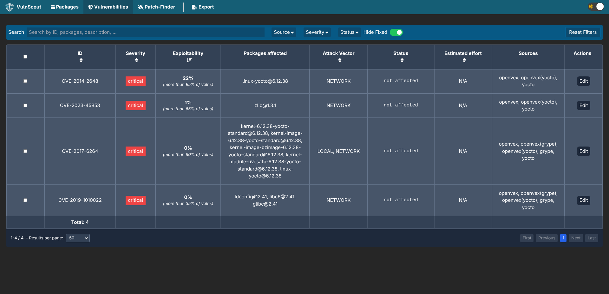
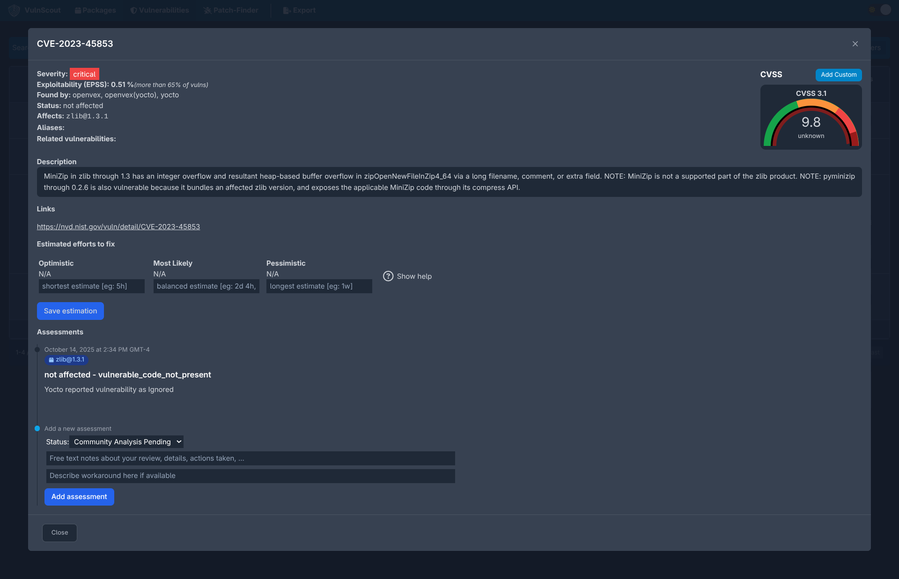

= VulnScout Screenshots
Savoir-faire Linux Inc.
:source-highlighter: highlight.js

---

== Overview

This page presents a few screenshots of the VulnScout user interface,
illustrating how vulnerabilities and SBOM data can be explored and managed
visually.

The web dashboard is designed to be lightweight and intuitive, allowing
developers and security teams to:

* Explore software components and their associated vulnerabilities
* Filter and prioritize issues based on severity or EPSS score
* Review and annotate vulnerability details directly from the browser

---

== Dashboard Overview

image::../doc/images/screenshots/dashboard.png[alt=VulnScout dashboard, width=900, align=center]

The Dashboard provides a high-level overview of detected vulnerabilities across
all analyzed SBOMs.

It displays aggregated metrics such as:

* Total number of components scanned
* Number of vulnerabilities detected per severity level
* Trend indicators for risk exposure over time

From this view, users can drill down into detailed component or vulnerability pages.

---

== Vulnerability List

The Vulnerability List view shows all known vulnerabilities correlated with your SBOM components.

Each row provides quick access to:

* CVE identifiers and severity scores
* Package or component affected
* Status (open, under review, resolved)
* Links to upstream advisories and references

Filters at the top of the page allow users to narrow the list by severity,
source, or affected component.

---

== Vulnerability Details and Editing

The **CVE Detail** view lets you review and annotate vulnerability information.

You can:

* See complete metadata (CVSS vector, EPSS, publication date)
* Add internal comments or remediation notes
* Update the vulnerability status once a fix is verified

This page supports collaboration between development and security teams,
ensuring that each issue is properly tracked and documented.
